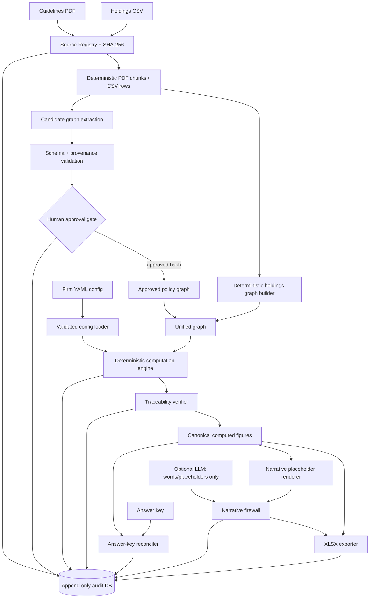

# InterOpera Senior Software Engineer Take-Home

## Implementation-Ready Technical Specification

**Status:** Ready for implementation  
**Target implementation language:** Python 3.12  
**Specification version:** 1.0  
**Scope:** One-week assessment implementation (24-32 hours), not a production platform  
**Documentation and code-comment language:** English

---

## 1. Purpose

Build a runnable, audit-defensible reporting system for the fictional Meridian Fixed Income Fund. The system ingests the supplied investment-guidelines PDF and holdings CSV into one knowledge graph, applies a selected firm's configurable calculation conventions, computes every report figure deterministically through graph traversal, populates the supplied XLSX report template, reconciles output against the relevant answer key, and records the run in a persistent append-only audit log.

The implementation is successful only if all five hard constraints hold:

1. The same inputs produce byte-identical computed figures on repeated runs.
2. Every emitted figure resolves through an explicit graph path to exact source chunks.
3. No LLM produces, rounds, formats, selects, or alters any reported number.
4. Firm A output reconciles to `firm_A_answer_key.xlsx` exactly under the formatting rules in this specification.
5. Firm B output is produced by changing configuration only, with no engine-code edit.

This specification is grounded in:

- `homework_brief.pdf`, 6 pages.
- `sample_docs/sample_fund_guidelines.pdf`, 4 pages.
- `sample_docs/sample_holdings.csv`, 13 position rows.
- `sample_docs/report_template.xlsx`, one sheet and 13 metric rows.
- `sample_docs/firm_A_answer_key.xlsx`, one sheet and 13 expected metric rows.
- `sample_docs/firm_B_brief.md`, three method variants and their changed expected figures.

### 1.1 Normative language

`MUST`, `MUST NOT`, `SHOULD`, and `MAY` are normative. When this specification differs from an assumption inferred from financial-domain convention, the supplied source documents take precedence.

### 1.2 Out of scope

- Web UI, authentication, authorization, and multi-tenancy.
- Production secrets management and production-grade access controls.
- Distributed processing, external graph databases, and vector databases.
- Live market data, VaR, Expected Shortfall, tracking error, and stress-scenario calculation; the holdings snapshot does not contain sufficient inputs and these figures are not present in the report template.
- Editing any supplied file in `sample_docs/`.
- Using the Firm A answer key as an engine input.

---

## 2. Source-of-truth hierarchy and assumptions

### 2.1 Source precedence

When two sources play different roles, use this hierarchy:

1. `sample_fund_guidelines.pdf` defines policy limits, included asset classes, actions, owners/recipients, and retention requirements.
2. `sample_holdings.csv` defines the period-end position facts used in calculations.
3. `firm_<id>.yaml` defines a firm's house calculation and presentation conventions.
4. Answer keys validate results only after computation; they MUST NOT influence computation.
5. `report_template.xlsx` defines output row order and target columns, not business logic.

Firm B configuration may intentionally change the default interpretation of the guidelines where `firm_B_brief.md` explicitly says so.

### 2.2 Explicit assumptions

- NAV is the sum of `market_value_sgd` across all holdings because no independent NAV field is supplied. For the sample, NAV is exactly `SGD 100,000,000`.
- All holdings are included in NAV; there are no liabilities, accrued interest adjustments, or derivatives in the sample.
- `modified_duration` is already an instrument-level modified duration. Portfolio duration is market-value weighted.
- Position DV01 uses the assessment's simple approximation: `market_value_sgd * modified_duration * 0.0001`.
- The normal-condition liquidity floor of 25% applies. The 35% stressed floor does not apply because no stress-condition input is supplied.
- Firm A GRE concentration groups by legal issuer name. Firm B groups GREs by `parent_issuer`.
- Firm B's fallen-angel addition requires a current rating below investment grade and a populated `downgraded_from` value showing an investment-grade prior rating.
- Equal-to-maximum is `AT LIMIT`, not `BREACH`. Equal-to-minimum is `OK`. Greater-than-maximum and less-than-minimum are `BREACH`.
- Material-breach classification (`actual > 110% of a hard limit`) is stored as metadata but does not replace the report status required by the supplied template.
- CSV provenance uses `page: null` and a one-based data `row_number`; it MUST NOT invent a page number.

### 2.3 Resolved sample-domain facts

The supplied holdings sum to:

| Fact | Deterministic value |
|---|---:|
| NAV | SGD 100,000,000 |
| SGS | SGD 35,000,000 |
| MAS Bills | SGD 8,000,000 |
| Investment Grade Corporate Bonds | SGD 33,000,000 |
| High Yield Bonds | SGD 9,000,000 |
| Foreign Currency Bonds | SGD 5,000,000 |
| Structured Credit | SGD 6,000,000 |
| Cash | SGD 4,000,000 |
| Firm A aggregate non-IG | SGD 15,000,000 |
| Firm B aggregate non-IG | SGD 21,000,000 |
| Liquid assets | SGD 47,000,000 |
| Weighted duration numerator | 387,900,000 SGD-years |
| Portfolio modified duration | 3.879 years |
| Portfolio DV01 | SGD 38,790 per bp |

---

## 3. Required repository layout

```text
interopera-assessment/
├── README.md
├── pyproject.toml
├── Dockerfile
├── docker-compose.yml
├── .env.example
├── sample_docs/
│   ├── sample_fund_guidelines.pdf
│   ├── sample_holdings.csv
│   ├── report_template.xlsx
│   ├── firm_A_answer_key.xlsx
│   └── firm_B_brief.md
├── config/
│   ├── firm_a.yaml
│   └── firm_b.yaml
├── approved_graph/
│   ├── meridian_guidelines_v2_1.json
│   ├── approval.json
│   └── chunks.json
├── src/interopera/
│   ├── __init__.py
│   ├── cli.py
│   ├── errors.py
│   ├── canonical.py
│   ├── domain/
│   │   ├── models.py
│   │   ├── enums.py
│   │   └── rating_scale.py
│   ├── ingestion/
│   │   ├── source_registry.py
│   │   ├── pdf_chunks.py
│   │   ├── holdings.py
│   │   └── approval.py
│   ├── graph/
│   │   ├── schema.py
│   │   ├── builder.py
│   │   ├── repository.py
│   │   ├── queries.py
│   │   ├── validation.py
│   │   └── serialization.py
│   ├── config/
│   │   ├── models.py
│   │   └── loader.py
│   ├── computation/
│   │   ├── engine.py
│   │   ├── allocation.py
│   │   ├── aggregate.py
│   │   ├── concentration.py
│   │   ├── liquidity.py
│   │   ├── market_risk.py
│   │   ├── status.py
│   │   └── formatting.py
│   ├── traceability/
│   │   ├── resolver.py
│   │   └── verifier.py
│   ├── narrative/
│   │   ├── ports.py
│   │   ├── openai_adapter.py
│   │   ├── templates.py
│   │   └── firewall.py
│   ├── reconciliation/
│   │   ├── answer_key.py
│   │   └── reconciler.py
│   ├── audit/
│   │   ├── schema.sql
│   │   ├── store.py
│   │   └── verifier.py
│   ├── export/
│   │   ├── json_exporter.py
│   │   └── xlsx_exporter.py
│   └── orchestration/
│       └── pipeline.py
├── docs/
│   ├── 01_flow_and_audit_events.md
│   ├── 02_architecture.md
│   └── 03_rfc.md
├── tests/
│   ├── unit/
│   ├── integration/
│   ├── golden/
│   └── fixtures/
└── output/
    └── .gitkeep
```

Generated reports, audit databases, and run manifests go under `output/<run_id>/` and are not committed. Approved graph fixtures and their approval record are committed so the evaluator can run the core pipeline without an LLM key.

---

## 4. Architecture

### 4.1 Style

Use a modular monolith with ports at nondeterministic or I/O boundaries. Do not introduce microservices. Use:

- Pydantic v2 for validated immutable domain/config models.
- `decimal.Decimal` for all numeric computation.
- NetworkX `MultiDiGraph` or an equivalently explicit in-process directed property graph.
- Canonical JSON as the persisted graph and computed-figure interchange format.
- SQLite for the append-only, hash-chained audit store.
- `openpyxl` for reading the answer key and populating the supplied report template.
- PyMuPDF for deterministic PDF text blocks and page coordinates.
- Typer or `argparse` for the CLI.
- `pytest` for tests.

### 4.2 Component flow



### 4.3 Mandatory dependency direction

```text
orchestration -> application modules -> domain
I/O adapters  -> application ports    -> domain
domain        -> standard library only
```

The computation package MUST depend only on `GraphReadPort`, validated `FirmConfig`, domain models, and Decimal utilities. It MUST NOT import PDF, CSV, XLSX, answer-key, LLM, or audit adapters.

### 4.4 Module contracts

| Module | Owns | Receives | Returns | MUST NOT |
|---|---|---|---|---|
| `source_registry` | source hashes and metadata | file paths | immutable `SourceDocument` records | interpret rules |
| `pdf_chunks` | page-aware stable chunks | registered PDF | `SourceChunk[]` | call an LLM |
| `holdings` | strict CSV parsing | registered CSV | validated holdings records | calculate report figures |
| `graph.builder` | unified property graph | chunks, holdings, approved extraction | graph version | emit report values |
| `graph.repository` | traversals and graph lookup | graph version | typed graph results + traversed IDs | expose raw file readers to engine |
| `config.loader` | YAML parsing and validation | config path | immutable `FirmConfig` + hash | branch on firm name in engine |
| `computation` | raw values, statuses, formatting | graph port + firm config | `ComputedFigure[]` | read answer keys or call an LLM |
| `traceability` | complete lineage proof | figure + graph | verified trace or error | repair missing lineage silently |
| `narrative` | commentary words/placeholders | qualitative facts only | safe narrative template | receive raw numeric values in LLM prompt |
| `reconciliation` | post-computation comparison | computed figures + answer key | per-figure deltas | feed values back to computation |
| `audit` | append-only event persistence | canonical events | receipt/hash | update or delete rows |
| `export` | JSON/XLSX rendering | verified figures + safe narrative | files + hashes | recompute or round values |

---

## 5. End-to-end pipeline and gates

### 5.1 Pipeline states

1. Register every input and compute SHA-256.
2. Load a validated firm configuration and compute its canonical SHA-256.
3. Chunk the guidelines deterministically by page and structural block.
4. Load an approved policy graph matching the exact guidelines hash, or enter graph-build review flow.
5. Parse holdings strictly and build holdings nodes/edges deterministically.
6. Merge policy and holdings graphs; validate schema, provenance, referential integrity, and uniqueness.
7. Compute figures through `GraphReadPort` traversals only.
8. Resolve and verify traceability for every figure. Failed traces produce error figures and block report export.
9. Serialize canonical raw and display figures.
10. Reconcile against an answer key if provided. Reconciliation is read-only and post-computation.
11. Optionally request qualitative narrative templates from an LLM and apply the firewall.
12. Populate a copy of the XLSX template without formulas.
13. Write the run manifest and verify audit-chain integrity.

### 5.2 Human approval gates

| Gate | Auto-pass criterion | Human-review criterion | Blocking behavior |
|---|---|---|---|
| Source registration | readable file; expected MIME/extension; hash computed | missing/unreadable/unexpected type | stop |
| Holdings validation | all required columns; unique IDs; valid Decimals; known asset classes; nonnegative MV; total NAV > 0 | unresolved asset class, invalid rating, duplicate ID, malformed value | stop |
| Policy extraction | previously approved graph exists for exact source SHA-256 and extractor/schema version | new source hash, changed extractor/schema, confidence below threshold, or unresolved entity/reference | stop until approval |
| Unified graph validation | all required relationships and provenance exist | orphan node, dangling edge, missing source chunk, duplicate business key | stop |
| Figure trace | complete figure-to-source path for inputs, rule, and method config | any missing/broken path | emit `TRACEABILITY_ERROR`; block XLSX |
| Reconciliation | every row exact under canonical display comparison | any mismatch | produce artifacts but exit nonzero in `--strict-reconcile` mode |
| Narrative | placeholders-only response; allowed vocabulary/structure; no numeric token | digits, number words, unknown placeholder, unsafe markup | discard narrative; numeric report remains valid |

### 5.3 Approved graph reuse

`approved_graph/approval.json` MUST contain:

```json
{
  "source_sha256": "<guidelines-pdf-sha256>",
  "graph_sha256": "<canonical-graph-sha256>",
  "schema_version": "1.0",
  "extractor_version": "1.0",
  "approved_by": "assessment-author",
  "approved_at": "<ISO-8601 UTC timestamp>",
  "decision": "APPROVED"
}
```

The sample committed graph MAY be manually authored from the supplied PDF. If an LLM-assisted extractor is implemented, its output is always a candidate and never trusted until this gate is satisfied.

---

## 6. Domain data models

All Pydantic models use `ConfigDict(frozen=True, extra="forbid")`. Decimal fields are constructed from strings, never binary floats.

### 6.1 Provenance

```python
class Provenance(BaseModel):
    source_document_id: str
    source_doc: str
    source_sha256: str
    page: int | None                 # one-based PDF page; null for CSV/YAML/system
    row_number: int | None           # one-based CSV data row; null otherwise
    line_start: int | None           # one-based text/YAML line
    line_end: int | None
    chunk_id: str
    chunk_sha256: str
    ingestion_time: datetime         # UTC, audit metadata; excluded from deterministic figure digest
    extraction_method: Literal["deterministic", "llm_candidate", "human_authored", "derived"]
    extraction_confidence: Decimal   # [0, 1]; deterministic facts use 1.0
    passage_summary: str
```

`chunk_id` is stable and content-addressed:

```text
chunk_id = "chunk_" + sha256(
  source_sha256 + ":" + page_or_row + ":" + normalized_chunk_text
)[:16]
```

Every graph node and edge MUST contain one or more provenance records. An edge inferred deterministically from a CSV row cites that row. A derived figure edge cites all contributing position facts, its policy-rule chunk, and its config-rule line range.

Root-source convention: a `SourceDocument` node cites a deterministic synthetic registration chunk named `manifest:<source_sha256>`; a `SourceChunk` node cites itself plus that registration chunk. This terminates provenance traversal without inventing a business-document page. Synthetic registration chunks use `page: null`, `row_number: null`, `extraction_method: deterministic`, and confidence `1.0`.

### 6.2 Source models

```python
class SourceDocument(BaseModel):
    id: str
    filename: str
    media_type: str
    sha256: str
    size_bytes: int
    registered_at: datetime

class SourceChunk(BaseModel):
    id: str
    source_document_id: str
    page: int | None
    row_number: int | None
    text: str
    normalized_text_sha256: str
    bbox: tuple[Decimal, Decimal, Decimal, Decimal] | None
```

### 6.3 Holding record

```python
class HoldingRecord(BaseModel):
    instrument_id: str
    instrument_name: str
    asset_class: str
    issuer_name: str
    issuer_type: Literal["government", "corporate", "GRE", "spv", "cash"]
    parent_issuer: str | None
    credit_rating: str | None
    downgraded_from: str | None
    market_value_sgd: Decimal
    modified_duration: Decimal
    provenance: Provenance
```

Validation rules:

- `instrument_id` is nonempty and unique.
- `market_value_sgd >= 0`; sample pipeline rejects zero-NAV portfolios.
- `modified_duration >= 0`.
- `issuer_type == "GRE"` SHOULD have `parent_issuer`; Firm B computation MUST error if grouping is `parent_issuer` and it is absent.
- Ratings must be null or members of the configured rating scale.
- CSV header must match the expected columns exactly; extra columns MAY be allowed only via an explicit loader option.

### 6.4 Policy-rule model

```python
class LimitRule(BaseModel):
    id: str
    metric_id: str
    kind: Literal["min", "max", "range"]
    min_value: Decimal | None
    max_value: Decimal | None
    unit: Literal["nav_ratio", "years", "sgd_per_bp"]
    exclusions: tuple[str, ...] = ()
    breach_action_ids: tuple[str, ...]
    owner_ids: tuple[str, ...]
    provenance: tuple[Provenance, ...]
```

### 6.5 Computed figure

```python
class NumericValue(BaseModel):
    amount: Decimal
    unit: Literal["ratio", "years", "sgd_per_bp", "bps"]

class Citation(BaseModel):
    source_doc: str
    page: int | None
    row_number: int | None
    chunk_id: str
    passage_summary: str

class TraceStep(BaseModel):
    ordinal: int
    from_node_id: str
    edge_id: str
    relation: str
    to_node_id: str
    provenance_refs: tuple[str, ...]

class ComputedFigure(BaseModel):
    figure_id: str
    section: str
    metric: str
    raw_value: NumericValue | None
    display_value: str | None
    raw_limit: LimitRule
    display_limit: str
    raw_utilization: Decimal | None
    display_utilization: str
    status: Literal["OK", "AT LIMIT", "BREACH", "ERROR"]
    material_breach: bool
    calculation_id: str
    formula_version: str
    config_rule_ids: tuple[str, ...]
    input_node_ids: tuple[str, ...]
    graph_path: tuple[TraceStep, ...]
    citations: tuple[Citation, ...]
    error: dict[str, str] | None
```

`display_*` fields are produced only by deterministic formatters. The exporter copies them verbatim.

### 6.6 Run manifest

```json
{
  "run_id": "sha256:<deterministic-input-fingerprint>",
  "started_at": "<UTC informational timestamp>",
  "software_version": "<git SHA or package version>",
  "graph_schema_version": "1.0",
  "formula_version": "1.0",
  "firm_id": "firm_a",
  "input_hashes": {},
  "config_sha256": "...",
  "approved_graph_sha256": "...",
  "computed_figures_sha256": "...",
  "report_sha256": "...",
  "reconciliation_summary": {},
  "traceability_summary": {},
  "narrative_firewall_summary": {},
  "audit_chain_head": "..."
}
```

Timestamps are not included in the computed-figure digest. `run_id` is derived from sorted input hashes, config hash, graph hash, and software/formula version, making replay identity stable.

---

## 7. Knowledge graph schema

### 7.1 Graph technology and persistence

Use a directed property multigraph. Persist it as canonical node-link JSON with nodes and edges sorted by ID. Parallel relationships are allowed. Graph IDs MUST be stable across repeated ingestion of the same inputs.

The engine MUST receive only a `GraphReadPort`; it MUST NOT receive parsed CSV rows or guideline dictionaries. This structurally ensures that every calculation consumes graph-resolved facts.

### 7.2 Node labels

| Label | Business key / example | Required properties |
|---|---|---|
| `SourceDocument` | `doc:guidelines:<sha>` | filename, sha256, media type |
| `SourceChunk` | `chunk_<hash>` | page/row, text hash, passage summary |
| `Portfolio` | `portfolio:meridian_fixed_income` | name, base currency |
| `Position` | `position:SGS-01` | instrument fields, market value, duration, rating |
| `AssetClass` | `asset_class:sgs` | canonical name |
| `Issuer` | `issuer:changi_logistics_pte_ltd` | name, issuer type |
| `ParentIssuer` | `parent:redhill_holdings` | name |
| `Metric` | `metric:portfolio_duration` | name, unit |
| `Aggregate` | `aggregate:non_ig` | name |
| `LiquidityBucket` | `liquidity:normal` | included class keys |
| `LimitRule` | `limit:allocation:sgs` | kind, min/max, unit |
| `BreachAction` | `action:pm_notification_1h` | action text, deadline |
| `Owner` | `owner:portfolio_manager` | display name/type |
| `RetentionRule` | `retention:audit_7y` | duration, record class |
| `FirmMethodRule` | `method:firm_b:gre_grouping` | strategy and parameters |
| `CalculationRun` | `run:<fingerprint>` | config/graph/software hashes |
| `Figure` | `figure:<run>:aggregate_non_ig` | raw/display value, status, formula ID |

### 7.3 Edge types

| Relationship | From -> To | Meaning |
|---|---|---|
| `DERIVED_FROM` | any node -> `SourceChunk` | exact provenance anchor |
| `PART_OF` | `SourceChunk` -> `SourceDocument` | source containment |
| `HOLDS` | `Portfolio` -> `Position` | portfolio membership |
| `BELONGS_TO` | `Position` -> `AssetClass` | allocation classification |
| `ISSUED_BY` | `Position` -> `Issuer` | legal issuer |
| `ROLLS_UP_TO` | `Issuer` -> `ParentIssuer` | parent grouping |
| `SUBJECT_TO` | `AssetClass`/`Metric`/`Aggregate` -> `LimitRule` | applicable policy limit |
| `CONTRIBUTES_TO` | `AssetClass` -> `Aggregate` | default aggregate membership |
| `INCLUDED_IN` | `AssetClass` -> `LiquidityBucket` | liquid-asset membership |
| `HAS_BREACH_ACTION` | `LimitRule` -> `BreachAction` | action when violated |
| `NOTIFIES` | `BreachAction` -> `Owner` | recipient/owner |
| `HAS_RETENTION` | report/audit rule -> `RetentionRule` | retention obligation |
| `USED_CONFIG_RULE` | `Figure` -> `FirmMethodRule` | method/presentation convention |
| `USED_INPUT` | `Figure` -> `Position`/`Metric` | calculation dependency |
| `EVALUATED_AGAINST` | `Figure` -> `LimitRule` | rule dependency |
| `PRODUCED_IN` | `Figure` -> `CalculationRun` | run identity |

Every edge has an `edge_id`, label, source/target IDs, schema version, and provenance list.

### 7.4 Required policy chunks and page anchors

The committed approved graph MUST contain page-aware chunks covering at least:

| Content | PDF page |
|---|---:|
| SGS, MAS Bills, IG corporate, high-yield allocation limits | 1 |
| Foreign bonds, structured credit, cash limits, aggregate non-IG cap | 2 |
| Duration/DV01 limits and actions | 2 |
| Single issuer and GRE concentration caps | 2 |
| Fallen-angel review rule | 2 |
| Normal and stressed liquidity floors | 2 |
| Reporting recipients and retention | 3 |
| Audit provenance, transformation, version, immutability, retention | 3 |
| Exception/breach reporting and material-breach rule | 3 |

### 7.5 Required traversals

`GraphReadPort` exposes typed operations:

```python
class GraphReadPort(Protocol):
    def portfolio_positions(self, portfolio_id: str) -> tuple[PositionFact, ...]: ...
    def positions_for_asset_class(self, portfolio_id: str, asset_class_id: str) -> tuple[PositionFact, ...]: ...
    def allocation_limit(self, asset_class_id: str) -> RuleWithTrace: ...
    def aggregate_members(self, aggregate_id: str) -> tuple[AssetClassFact, ...]: ...
    def metric_limit(self, metric_id: str) -> RuleWithTrace: ...
    def issuers(self, portfolio_id: str, issuer_type: str | None = None) -> tuple[IssuerFact, ...]: ...
    def parent_of(self, issuer_id: str) -> ParentIssuerFact | None: ...
    def liquid_asset_classes(self, bucket_id: str) -> tuple[AssetClassFact, ...]: ...
    def breach_route(self, limit_id: str) -> tuple[BreachActionFact, tuple[OwnerFact, ...]]: ...
    def source_chunks_for_path(self, node_ids: tuple[str, ...], edge_ids: tuple[str, ...]) -> tuple[SourceChunk, ...]: ...
```

Required multi-hop query test:

```text
Metric:portfolio_duration
  -SUBJECT_TO-> LimitRule:duration_2_0_6_5
  -HAS_BREACH_ACTION-> BreachAction:pm_notification_within_1h
  -NOTIFIES-> Owner:portfolio_manager
  -DERIVED_FROM-> SourceChunk:<guidelines-page-2-chunk>
```

The answer MUST be obtained by graph traversal without reading the PDF during the query.

### 7.6 Graph integrity invariants

- Every node and edge has at least one valid provenance reference.
- Every provenance `chunk_id` resolves to an existing `SourceChunk` whose source hash matches the registry.
- Every position belongs to exactly one asset class and is issued by exactly one issuer.
- Every reportable asset class has exactly one active allocation rule.
- Every reportable metric/aggregate has exactly one active rule for the graph version.
- Every FirmMethodRule is derived from the selected config file and carries config hash plus YAML line provenance.
- No orphan `Figure` is exportable: it must connect to a run, config rule, input(s), rule, and source chunk(s).
- Graph serialization is canonical and byte-stable for identical logical content. Informational ingestion timestamps are either stored in a separate manifest or excluded from graph equality/digest comparisons.

---

## 8. Firm configuration

### 8.1 Design rule

The engine MUST NOT contain `if firm == "A"`, `if firm == "B"`, firm-specific subclasses, or hard-coded firm names. It may dispatch only on validated generic strategy enums such as `asset_class_membership`, `rating_with_transition`, `issuer`, `parent_issuer`, `percent`, and `truncated_bps`.

Adding Firm C with supported strategies requires a new YAML file only. Adding a genuinely new strategy may require engine extension, but neither existing firm config may be embedded in code.

### 8.2 Configuration schema

```yaml
schema_version: "1.0"
firm_id: string
display_name: string

nav:
  source: sum_position_market_value
  currency: SGD

aggregate_non_ig:
  base_membership:
    strategy: asset_class_membership
    asset_classes: [string]
  additions:
    - strategy: rating_with_transition
      current_rating_at_or_below: BB+
      prior_rating_at_or_above: BBB-
      require_downgraded_from: boolean
  deduplicate_by: instrument_id

concentration:
  corporate:
    issuer_types: [corporate]
    exclude_issuers: [Singapore Government]
    grouping_key: issuer_name
  gre:
    issuer_types: [GRE]
    grouping_key: issuer_name | parent_issuer
    missing_group_key: error | fallback_to_issuer

liquidity:
  condition: normal
  bucket_id: liquidity:normal

utilization:
  max_or_upper_bound:
    formula: actual_divided_by_limit
  min_or_lower_bound:
    formula: not_applicable
  representation: percent | basis_points
  decimals: integer
  rounding: ROUND_HALF_UP | ROUND_DOWN

value_formatting:
  ratios:
    percent_decimals: 1
    rounding: ROUND_HALF_UP
  duration:
    decimals: 2
    rounding: ROUND_HALF_UP
  currency:
    decimals: 0
    thousands_separator: true
```

### 8.3 Firm A configuration

```yaml
schema_version: "1.0"
firm_id: firm_a
display_name: Firm A
nav: {source: sum_position_market_value, currency: SGD}
aggregate_non_ig:
  base_membership:
    strategy: asset_class_membership
    asset_classes: ["High Yield Bonds", "Structured Credit"]
  additions: []
  deduplicate_by: instrument_id
concentration:
  corporate:
    issuer_types: [corporate]
    exclude_issuers: ["Singapore Government"]
    grouping_key: issuer_name
  gre:
    issuer_types: [GRE]
    grouping_key: issuer_name
    missing_group_key: error
liquidity: {condition: normal, bucket_id: "liquidity:normal"}
utilization:
  max_or_upper_bound: {formula: actual_divided_by_limit}
  min_or_lower_bound: {formula: not_applicable}
  representation: percent
  decimals: 1
  rounding: ROUND_HALF_UP
value_formatting:
  ratios: {percent_decimals: 1, rounding: ROUND_HALF_UP}
  duration: {decimals: 2, rounding: ROUND_HALF_UP}
  currency: {decimals: 0, thousands_separator: true}
```

### 8.4 Firm B configuration

```yaml
schema_version: "1.0"
firm_id: firm_b
display_name: Firm B
nav: {source: sum_position_market_value, currency: SGD}
aggregate_non_ig:
  base_membership:
    strategy: asset_class_membership
    asset_classes: ["High Yield Bonds", "Structured Credit"]
  additions:
    - strategy: rating_with_transition
      current_rating_at_or_below: BB+
      prior_rating_at_or_above: BBB-
      require_downgraded_from: true
  deduplicate_by: instrument_id
concentration:
  corporate:
    issuer_types: [corporate]
    exclude_issuers: ["Singapore Government"]
    grouping_key: issuer_name
  gre:
    issuer_types: [GRE]
    grouping_key: parent_issuer
    missing_group_key: error
liquidity: {condition: normal, bucket_id: "liquidity:normal"}
utilization:
  max_or_upper_bound: {formula: actual_divided_by_limit}
  min_or_lower_bound: {formula: not_applicable}
  representation: basis_points
  decimals: 0
  rounding: ROUND_DOWN
value_formatting:
  ratios: {percent_decimals: 1, rounding: ROUND_HALF_UP}
  duration: {decimals: 2, rounding: ROUND_HALF_UP}
  currency: {decimals: 0, thousands_separator: true}
```

### 8.5 Rating scale

Implement an explicit ordered rating scale, highest to lowest:

```text
AAA, AA+, AA, AA-, A+, A, A-, BBB+, BBB, BBB-, BB+, BB, BB-, B+, B, B-, CCC+, CCC, CCC-, CC, C, D
```

Never compare rating strings lexicographically. Null ratings do not qualify for rating predicates. The sample fallen angel `COR-05` qualifies because current `BB` is below `BBB-`, prior `BBB-` was investment grade, and `downgraded_from` is populated.

---

## 9. Deterministic computation specification

### 9.1 Numeric rules

- Parse all numeric source fields with `Decimal(source_string)`.
- Set an explicit decimal context with precision at least 28.
- Do not round intermediate calculations.
- Quantize only in deterministic formatters.
- Percent display: `ratio * 100`, quantized to configured decimals.
- Firm A utilization: `(actual / applicable_max) * 100`, `ROUND_HALF_UP`, one decimal, followed by `%`.
- Firm B utilization: `(actual / applicable_max) * 10000`, `ROUND_DOWN` toward zero to an integer, followed by ` bps`.
- For range limits, utilization uses the upper bound.
- For minimum-only limits, utilization is `n/a`, matching the supplied answer key.
- Duration display uses two decimals and `ROUND_HALF_UP`.
- DV01 display uses zero decimals with comma grouping.
- JSON decimal values are serialized as canonical strings; JSON object keys are sorted; list ordering is specified below.

### 9.2 Stable ordering

- Report figures follow rows 2-14 of `report_template.xlsx`.
- Input position IDs and citation lists are sorted ascending.
- Concentration ties break by normalized group name ascending, then stable group ID.
- Graph nodes and edges sort by ID.
- Reconciliation rows follow report order.

### 9.3 NAV

```text
NAV = SUM(position.market_value_sgd for all portfolio positions)
```

Expected: `100000000`.

Failure conditions: no positions, NAV <= 0, invalid/missing market value, or a position lacking a trace to its CSV row.

### 9.4 Allocation per asset class

For each of the seven report asset classes:

```text
class_market_value = SUM(MV of positions reached through BELONGS_TO AssetClass)
allocation_ratio   = class_market_value / NAV
```

Status evaluation:

```text
if min is not null and actual < min: BREACH
else if max is not null and actual > max: BREACH
else if max is not null and actual == max: AT LIMIT
else: OK
```

Expected Firm A and B display values:

| Metric | Value | Limit | Firm A utilization | Status |
|---|---:|---:|---:|---|
| Singapore Government Securities | 35.0% | 20-60% | 58.3% | OK |
| MAS Bills | 8.0% | 0-40% | 20.0% | OK |
| Investment Grade Corporate Bonds | 33.0% | 10-50% | 66.0% | OK |
| High Yield Bonds | 9.0% | 0-15% | 60.0% | OK |
| Foreign Currency Bonds (hedged) | 5.0% | 0-20% | 25.0% | OK |
| Structured Credit (ABS/MBS) | 6.0% | 0-10% | 60.0% | OK |
| Cash & Cash Equivalents | 4.0% | min 5% | n/a | BREACH |

Firm B values/statuses are identical; non-`n/a` utilization strings use the configured truncated-bps representation (for example SGS `5833 bps`, MAS `2000 bps`, IG corporate `6600 bps`).

### 9.5 Aggregate non-investment-grade exposure

Base policy membership is graph-resolved from:

```text
AssetClass:High Yield Bonds -CONTRIBUTES_TO-> Aggregate:non_ig
AssetClass:Structured Credit -CONTRIBUTES_TO-> Aggregate:non_ig
```

Firm configuration can add generic predicates. Deduplicate the union by `instrument_id`.

```text
non_ig_mv    = SUM(MV of selected unique positions)
non_ig_ratio = non_ig_mv / NAV
limit        = 20% maximum
```

- Firm A includes `HY-01`, `HY-02`, `SC-01`: `15.0%`, utilization `75.0%`, `OK`.
- Firm B additionally includes fallen angel `COR-05`: `21.0%`, utilization `10500 bps`, `BREACH`.

Do not infer this aggregate solely from current credit rating: the guidelines explicitly include Structured Credit even though the sample structured-credit tranche is AAA.

### 9.6 Largest single corporate issuer

Select positions whose issuer node has type `corporate`, apply configured exclusions, group by `issuer_name`, sum market value, and select the maximum using the stable tie-break rule.

```text
group_ratio = group_market_value / NAV
limit       = 8% maximum
```

Expected: Changi Logistics Pte Ltd, `8.0%`, Firm A utilization `100.0%`, `AT LIMIT`. Firm B value/status is identical and utilization is `10000 bps`.

GREs are excluded from this corporate metric because they have their own 12% cap.

### 9.7 Largest GRE issuer/group

Select positions whose issuer node has type `GRE`.

- Firm A groups by `issuer_name`. Redhill Power is largest at `7.0%`; utilization `58.3%`; `OK`.
- Firm B groups by `parent_issuer`. Redhill Power and Redhill Transport roll up to Redhill Holdings: `13.0%`; utilization `10833 bps`; `BREACH`.

Limit: 12% maximum. If Firm B encounters a GRE without a parent and `missing_group_key: error`, return `CONFIGURED_GROUP_KEY_MISSING`; do not fall back silently.

### 9.8 Liquidity ratio

Traverse the normal-liquidity bucket's `INCLUDED_IN` relationships. The policy-defined members are SGS, MAS Bills, and Cash.

```text
liquid_mv    = SGS MV + MAS Bills MV + Cash MV
liquid_ratio = liquid_mv / NAV
limit        = 25% minimum under normal conditions
```

Expected: `47.0%`, `OK`. To match the answer key, liquidity utilization is calculated as actual/floor: Firm A `188.0%`; Firm B `18800 bps`. This is an explicit exception to the general `min_or_lower_bound: not_applicable` presentation rule and MUST be represented as a metric-level config override or a generic `floor_coverage` utilization strategy, not a firm-name branch.

Add this configuration block to both firm files:

```yaml
metric_overrides:
  liquid_assets_ratio:
    utilization_formula: floor_coverage
```

The stressed floor MUST remain modeled and queryable but is not selected for this report because the condition is `normal`.

### 9.9 Portfolio modified duration

```text
weighted_duration_numerator = SUM(position.MV * position.modified_duration)
portfolio_modified_duration = weighted_duration_numerator / NAV
```

Expected raw: `3.879`; display: `3.88 yrs`; limit: `2.0-6.5 yrs`; utilization: `n/a`; status: `OK`.

The figure trace includes every contributing position node, the portfolio/NAV dependency, the metric node, the duration rule, and source chunks/rows.

### 9.10 Portfolio DV01

```text
position_dv01  = position.MV * position.modified_duration * Decimal("0.0001")
portfolio_dv01 = SUM(position_dv01)
```

Expected raw: `38790.00000`; display: `SGD 38,790 / bp`; maximum: `85000`; Firm A utilization: `45.6%`; Firm B utilization: `4563 bps`; status: `OK`.

### 9.11 Material breach

For maximum rules:

```text
material_breach = actual > max_limit * Decimal("1.10")
```

For minimum rules, set false unless a separately sourced policy defines materiality. Do not invent a reverse-floor formula. This metadata supports breach reporting and is not a template column.

### 9.12 Figure calculation identifiers

Use stable identifiers:

```text
allocation.nav_ratio.v1
aggregate.membership_union.nav_ratio.v1
concentration.group_max.nav_ratio.v1
liquidity.bucket.nav_ratio.v1
market_risk.weighted_modified_duration.v1
market_risk.dv01_approximation.v1
```

Every `FIGURE_COMPUTED` event records the calculation ID, formula expression, ordered input node IDs, unrounded raw value, formatter config, and final display value.

---

## 10. Traceability and provenance

### 10.1 Required proof shape

Each figure must prove three things:

1. **Data lineage:** which graph position facts supplied the numerator/denominator.
2. **Policy lineage:** which graph rule supplied the limit and business membership.
3. **Method lineage:** which firm-config graph node selected grouping, inclusion, utilization, and formatting behavior.

Example conceptual path for Firm B aggregate non-IG:

```text
Figure:aggregate_non_ig
  -USED_INPUT-> Position:HY-01 -BELONGS_TO-> AssetClass:High Yield
  -USED_INPUT-> Position:HY-02 -BELONGS_TO-> AssetClass:High Yield
  -USED_INPUT-> Position:SC-01 -BELONGS_TO-> AssetClass:Structured Credit
  -USED_INPUT-> Position:COR-05 -ISSUED_BY-> Issuer:Marina Bay Resorts
  -USED_CONFIG_RULE-> FirmMethodRule:firm_b:fallen_angel
  -EVALUATED_AGAINST-> LimitRule:aggregate_non_ig_max_20
  -DERIVED_FROM-> Guidelines page 2 aggregate-cap chunk
  -DERIVED_FROM-> Holdings rows for HY-01, HY-02, SC-01, COR-05
  -DERIVED_FROM-> firm_b.yaml fallen-angel line range
```

### 10.2 Trace resolution algorithm

For every figure:

1. Confirm all `input_node_ids`, the selected rule ID, and config-rule IDs exist.
2. Resolve the recorded `TraceStep` edge sequence without path search ambiguity.
3. Confirm each referenced edge connects the declared nodes and carries provenance.
4. Follow all provenance references to source chunks.
5. Recompute each source chunk hash and confirm its source-document hash.
6. Require at least one holdings citation and one policy citation. Require a config citation where the calculation or presentation is config-driven.
7. Canonically serialize the verified trace and store its SHA-256 on the figure/audit event.

### 10.3 Failure behavior

If any requirement fails:

```json
{
  "figure_id": "aggregate_non_ig_exposure",
  "status": "ERROR",
  "display_value": null,
  "error": {
    "code": "TRACEABILITY_ERROR",
    "message": "Policy rule limit:aggregate_non_ig has no resolvable source chunk"
  }
}
```

The pipeline writes JSON diagnostics and audit events but MUST NOT export an XLSX containing that figure.

### 10.4 Human-readable XLSX source column

Column G receives a compact deterministic string, for example:

```text
figure:aggregate_non_ig -> asset_class:high_yield + asset_class:structured_credit -> limit:aggregate_non_ig | sample_fund_guidelines.pdf p.2 chunk_ab12...; sample_holdings.csv rows 9-11
```

Full position-by-position trace remains in `computed_figures.json` and `traces.json`; Excel need not contain the entire proof.

---

## 11. LLM narrative firewall

### 11.1 Structural boundary

The LLM is optional and may generate qualitative commentary only. The report template does not require narrative, so the default offline evaluator path can run with `--narrative-provider none`.

If an LLM is enabled:

- It receives no numeric raw values, display values, limits, percentages, dates, durations, currency amounts, basis points, position quantities, or deltas.
- It receives qualitative enums such as metric key, `within_limit`, `at_limit`, `breach`, trend-not-available, and allowed placeholder names.
- It returns a template containing words and approved placeholders, for example: `The portfolio duration is {{portfolio_modified_duration}} and remains within its approved range.`
- A deterministic renderer substitutes placeholders with preformatted computed values after validation.
- The LLM cannot choose a formatter or placeholder value.

### 11.2 Firewall stages

1. Reject any raw LLM response containing Unicode decimal digits (`\p{Nd}`), numeric punctuation patterns, number words (`one` through `trillion`), currency symbols/codes, `%`, `bp`, `bps`, or time/quantity abbreviations adjacent to digits.
2. Parse allowed `{{placeholder_name}}` tokens.
3. Reject unknown, repeated where forbidden, or missing required placeholders.
4. Restrict output to plain text; reject HTML/Markdown links and executable/template-control syntax.
5. Substitute placeholders deterministically.
6. Extract numeric tokens from the final narrative and compare the multiset of `(normalized numeric token, unit/context)` to the values inserted by the renderer.
7. Fail if any final numeric token cannot be attributed to an insertion record.

The final comparison is the explicit proof requested by the assessment; the digits-free raw response is the stronger preventive control.

### 11.3 LLM port

```python
class NarrativePort(Protocol):
    def draft(self, request: QualitativeNarrativeRequest) -> str: ...
```

Provide:

- `NoneNarrativeAdapter` for the no-key default.
- `OpenAINarrativeAdapter` (or one other frontier provider) enabled only when configured.
- `FakeNarrativeAdapter` for tests, including malicious numeric responses.

No LLM import or adapter is accessible from the computation package.

### 11.4 Firewall evidence

Write `narrative_firewall.json` containing:

- SHA-256 of qualitative request.
- SHA-256 of raw response.
- Raw-response numeric scan result.
- Allowed and used placeholders.
- Deterministic insertion ledger.
- Final numeric-token attribution result.
- Overall `PASS`, `SKIPPED`, or `FAIL`.

Do not store API secrets or authorization headers.

---

## 12. Reconciliation

### 12.1 Isolation rule

The answer key loader is invoked only after `computed_figures.json` has been finalized and hashed. The computation engine receives no answer-key object or path. Enforce this with module imports and an integration test.

### 12.2 Comparison unit

For this assessment, exact displayed-string matching is the authoritative comparison because the answer key cells are strings and specify required presentation. Also report numeric deltas using parsed canonical quantities.

Per row:

```json
{
  "figure_id": "portfolio_modified_duration",
  "expected": "3.88 yrs",
  "actual": "3.88 yrs",
  "expected_raw": "3.88",
  "actual_raw": "3.879",
  "delta": "-0.001",
  "display_match": true,
  "within_tolerance": true,
  "result": "PASS"
}
```

### 12.3 Tolerances

- Primary acceptance: exact `Value`, `Limit`, `Utilization`, and `Status` display strings for Firm A.
- Numeric diagnostic tolerance: half of the display quantum only (ratio value `0.0005` as a fraction for one-decimal percent; duration `0.005` years; DV01 `0.5` SGD/bp). This tolerance explains formatting but does not excuse a display mismatch.
- Firm B uses the explicit expected changed values in `firm_B_brief.md` and a generated expected fixture for unchanged rows. The fixture MUST be independently authored from the brief and sample facts, not copied from engine output during a test.

### 12.4 Reconciliation output

Create `reconciliation.json` and a console table with:

```text
Metric | Expected | Actual | Delta | Display | Trace | Result
```

Overall result is `PASS` only when every expected figure exists exactly once, all display fields match, all numeric deltas are within tolerance, and trace verification passes.

Unexpected or duplicate figures are failures.

---

## 13. Append-only audit log

### 13.1 Storage

Use SQLite in `output/audit/audit.sqlite3`. The application DB role exposes insert and read operations only. Add database triggers that reject update/delete even if someone executes raw SQL through the same database.

```sql
CREATE TABLE audit_events (
    id INTEGER PRIMARY KEY AUTOINCREMENT,
    run_id TEXT NOT NULL,
    sequence INTEGER NOT NULL,
    event_type TEXT NOT NULL,
    actor_type TEXT NOT NULL,
    actor_id TEXT NOT NULL,
    occurred_at TEXT NOT NULL,
    payload_json TEXT NOT NULL,
    previous_hash TEXT NOT NULL,
    event_hash TEXT NOT NULL,
    UNIQUE(run_id, sequence),
    UNIQUE(event_hash)
);

CREATE TRIGGER audit_events_no_update
BEFORE UPDATE ON audit_events
BEGIN
    SELECT RAISE(ABORT, 'audit log is append-only');
END;

CREATE TRIGGER audit_events_no_delete
BEFORE DELETE ON audit_events
BEGIN
    SELECT RAISE(ABORT, 'audit log is append-only');
END;
```

### 13.2 Hash chain

```text
event_hash = SHA256(
  previous_hash + "\n" +
  run_id + "\n" +
  sequence + "\n" +
  event_type + "\n" +
  canonical_payload_json
)
```

Use 64 zeroes as `previous_hash` for the first event of a run. Timestamps do not determine sequence; the writer allocates strictly increasing sequence numbers in one transaction.

### 13.3 Event catalogue

| Event | Trigger | Data captured | Retention |
|---|---|---|---|
| `RUN_STARTED` | pipeline begins | run ID, software/formula/schema versions | minimum 7 years |
| `SOURCE_REGISTERED` | input accepted | path/name, media type, size, SHA-256 | minimum 7 years |
| `SOURCE_CHUNKED` | chunks created | source hash, algorithm version, chunk IDs/hashes/pages | minimum 7 years |
| `GRAPH_CANDIDATE_CREATED` | extraction completes | extractor, model if used, candidate hash, confidences | minimum 7 years |
| `GRAPH_VALIDATION_COMPLETED` | graph checks run | graph hash, rules checked, errors | minimum 7 years |
| `GRAPH_APPROVAL_REUSED` | approved hash matches | approval ID, approver, source/graph hashes | minimum 7 years |
| `GRAPH_APPROVED` | human approves | approver, timestamp, source/graph hashes, decision | minimum 7 years |
| `GRAPH_REJECTED` | human rejects | reviewer, reason, candidate hash | minimum 7 years |
| `HOLDINGS_INGESTED` | CSV graph built | source hash, row count, NAV diagnostic, graph hash | minimum 7 years |
| `CONFIG_LOADED` | YAML validated | firm ID, config hash, schema version | minimum 7 years |
| `CONFIG_CHANGED` | active firm differs from previous recorded run/session | prior/new firm and hashes, actor | minimum 7 years |
| `FIGURE_COMPUTED` | each calculation completes | formula ID, inputs, raw/display values, limit, status, config rules | minimum 7 years |
| `FIGURE_ERROR` | calculation/trace fails | figure ID, error code, safe diagnostics | minimum 7 years |
| `TRACE_VERIFIED` | each trace resolves | figure ID, trace hash, graph/source references | minimum 7 years |
| `RECONCILIATION_COMPLETED` | comparison completes | answer-key hash, per-figure results/deltas, summary | minimum 7 years |
| `NARRATIVE_REQUESTED` | optional LLM call | provider/model, qualitative request hash; no secret | per report retention, minimum 7 years |
| `NARRATIVE_FIREWALL_COMPLETED` | firewall runs | response hash, scans, insertion ledger hash, result | per report retention, minimum 7 years |
| `REPORT_EXPORTED` | artifact written | template/output hashes, report version, figure digest | investor-facing: 10 years |
| `RUN_COMPLETED` | successful pipeline ends | artifact hashes, reconciliation/trace/firewall summary, chain head | minimum 7 years |
| `RUN_FAILED` | pipeline stops | stage, error code, message, last successful event | minimum 7 years |

For this assessment, retention is metadata and policy documentation; no automatic deletion job is implemented because deletion conflicts with the append-only demonstration and the sample is not a production retention system.

### 13.4 Immutability tests

- Direct `UPDATE audit_events ...` fails with the trigger message.
- Direct `DELETE FROM audit_events ...` fails with the trigger message.
- `AuditStore` exposes no update/delete methods.
- Modifying `payload_json` in an offline copied database causes `audit verify` to fail the hash chain.

---

## 14. XLSX and JSON output

### 14.1 XLSX contract

Copy `report_template.xlsx` to the run directory, preserving sheet name, row order, header styles, column widths, and existing formatting. Populate columns C-G for rows 2-14:

| Column | Value source |
|---|---|
| C `Value` | `ComputedFigure.display_value` |
| D `Limit` | `ComputedFigure.display_limit` |
| E `Utilization` | `ComputedFigure.display_utilization` |
| F `Status` | `ComputedFigure.status` |
| G `Source...` | deterministic compact trace summary |

Do not insert formulas. Do not write hidden answer-key values. Do not overwrite source/template files. Save as `output/<run_id>/<firm_id>_report.xlsx`.

### 14.2 Required output files

```text
output/<run_id>/
├── computed_figures.json
├── traces.json
├── reconciliation.json
├── narrative_firewall.json
├── run_manifest.json
└── <firm_id>_report.xlsx
```

### 14.3 Byte-identical determinism boundary

`computed_figures.json` and the deterministic projection in `traces.json` MUST be byte-identical on same-input replay. Runtime observations such as ingestion and audit timestamps remain in the graph/audit evidence but are excluded from the deterministic projection and its digest. XLSX ZIP containers may carry library metadata or timestamps; therefore the hard determinism assertion applies to the canonical numeric JSON and to a normalized XLSX cell-value projection. The exporter SHOULD set fixed workbook metadata and ZIP timestamps if practical, but evaluator proof MUST compare canonical figures rather than raw XLSX bytes.

---

## 15. CLI and start command

### 15.1 Single documented start command

The repository MUST run the full offline demo with:

```bash
docker compose up --build --abort-on-container-exit
```

The default compose command runs Firm A and Firm B sequentially using the same engine package, verifies traces/audit chains, reconciles Firm A, validates Firm B expectations, and exits nonzero on failure. It must not require an API key.

### 15.2 CLI commands

```bash
python -m interopera.cli run \
  --firm config/firm_a.yaml \
  --guidelines sample_docs/sample_fund_guidelines.pdf \
  --holdings sample_docs/sample_holdings.csv \
  --template sample_docs/report_template.xlsx \
  --answer-key sample_docs/firm_A_answer_key.xlsx \
  --output output \
  --strict-reconcile \
  --narrative-provider none

python -m interopera.cli run --firm config/firm_b.yaml [same source arguments]
python -m interopera.cli trace --run-id <id> --figure aggregate_non_ig_exposure
python -m interopera.cli reconcile --run-id <id> --answer-key <path>
python -m interopera.cli graph query --name duration-breach-route
python -m interopera.cli graph validate --graph approved_graph/meridian_guidelines_v2_1.json
python -m interopera.cli audit verify --database output/audit/audit.sqlite3 --run-id <id>
python -m interopera.cli demo
```

### 15.3 Exit codes

| Code | Meaning |
|---:|---|
| 0 | success |
| 2 | CLI/config validation error |
| 3 | source ingestion/approval error |
| 4 | graph validation or traceability error |
| 5 | computation error |
| 6 | reconciliation failure |
| 7 | narrative firewall failure |
| 8 | export/audit integrity failure |

---

## 16. Errors and failure modes

Implement these typed errors:

| Code | Trigger | Behavior |
|---|---|---|
| `SOURCE_HASH_MISMATCH` | stored approval/source does not match file | block graph use |
| `GRAPH_APPROVAL_REQUIRED` | no approval for current graph/source versions | block computation |
| `LOW_CONFIDENCE_EXTRACTION` | candidate below configured threshold | require review |
| `HOLDING_VALIDATION_ERROR` | malformed or unresolved CSV row | stop ingestion |
| `GRAPH_SCHEMA_ERROR` | missing/duplicate node/edge or broken invariant | stop |
| `CONFIG_SCHEMA_ERROR` | invalid strategy/parameter | stop before computation |
| `CONFIGURED_GROUP_KEY_MISSING` | required parent/group field absent | error affected figure and block export |
| `ZERO_NAV` | computed NAV <= 0 | stop computation |
| `TRACEABILITY_ERROR` | missing graph path/source | error figure and block export |
| `RECONCILIATION_MISMATCH` | expected vs actual differs | write diagnostics; nonzero if strict |
| `NARRATIVE_FIREWALL_FAILED` | LLM introduces/changes a numeric token | discard narrative; fail configured narrative run |
| `AUDIT_CHAIN_INVALID` | hash chain broken | fail run verification |

Messages must name the stage and stable entity IDs but must not leak API keys or full secrets.

---

## 17. Test plan

### 17.1 Unit tests

#### Numeric and formatting

- Decimal parsing never passes through float.
- Percent formatting uses `ROUND_HALF_UP` at the configured display boundary.
- `58.333...%` Firm A utilization becomes `58.3%`.
- `58.333...%` Firm B utilization becomes `5833 bps`, not `5834 bps`.
- `45.635...%` DV01 utilization becomes Firm A `45.6%` and Firm B `4563 bps`.
- Duration `3.879` becomes `3.88 yrs`.
- Exact max produces `AT LIMIT`; above max produces `BREACH`; exact min produces `OK`; below min produces `BREACH`.
- Stable concentration tie-break is deterministic.

#### Configuration

- Both YAML files validate against one schema.
- Unknown strategies and extra fields fail.
- No code path branches on `firm_a` or `firm_b`; add a source-scan test over `src/interopera/computation` for those literals.
- Rating comparisons use the ordered scale.
- Fallen-angel membership deduplicates positions already included by asset class.

#### Graph and provenance

- Every node/edge has valid provenance.
- CSV provenance has null page and correct data row.
- Every required rule and metric traversal resolves.
- Duration breach route reaches action and owner.
- Missing chunk reference fails validation.
- Canonical graph serialization is byte-stable.

#### Narrative

- Safe placeholders pass.
- Raw digit `99.5%` fails.
- Spelled number `ninety-nine` fails.
- Unknown placeholder fails.
- A final number is accepted only if present in the deterministic insertion ledger.

#### Audit

- Sequences are contiguous per run.
- Hash chain validates.
- SQL update/delete fail.
- Offline tamper is detected.

### 17.2 Integration tests

1. **Firm A golden run**: produces all 13 metrics and exact answer-key display fields.
2. **Firm B golden run**: uses the same graph and engine; produces changed non-IG, GRE, and utilization representation while all other raw values remain identical.
3. **Deterministic replay**: run Firm A twice; SHA-256 of canonical `computed_figures.json` and `traces.json` matches.
4. **Config-only switch**: run A then B by path; assert the computation source tree and software version are unchanged.
5. **Trace end-to-end**: pick aggregate non-IG; resolve figure -> positions/classes -> aggregate/limit -> exact PDF page-2 chunk plus CSV rows/config lines.
6. **Answer-key isolation**: modify a copied answer key; computed-figure digest is unchanged while reconciliation fails.
7. **Untraceable figure**: remove a copied rule's chunk reference; affected figure becomes `ERROR`, XLSX is not exported.
8. **Missing GRE parent**: with Firm B copied fixture, blank a GRE parent; get `CONFIGURED_GROUP_KEY_MISSING`.
9. **Malicious LLM**: fake adapter returns an invented number; firewall fails and no contaminated narrative/report is exported.
10. **Template preservation**: source file hash unchanged; output row labels/order/styles remain intact and C-G are populated.
11. **No-key startup**: container demo succeeds without an LLM environment variable.

### 17.3 Expected golden figures

| Figure ID | Firm A | Firm B |
|---|---|---|
| `allocation_sgs` | 35.0%, 58.3%, OK | 35.0%, 5833 bps, OK |
| `allocation_mas_bills` | 8.0%, 20.0%, OK | 8.0%, 2000 bps, OK |
| `allocation_ig_corporate` | 33.0%, 66.0%, OK | 33.0%, 6600 bps, OK |
| `allocation_high_yield` | 9.0%, 60.0%, OK | 9.0%, 6000 bps, OK |
| `allocation_foreign_bonds` | 5.0%, 25.0%, OK | 5.0%, 2500 bps, OK |
| `allocation_structured_credit` | 6.0%, 60.0%, OK | 6.0%, 6000 bps, OK |
| `allocation_cash` | 4.0%, n/a, BREACH | 4.0%, n/a, BREACH |
| `aggregate_non_ig_exposure` | 15.0%, 75.0%, OK | 21.0%, 10500 bps, BREACH |
| `largest_single_corporate_issuer` | 8.0%, 100.0%, AT LIMIT | 8.0%, 10000 bps, AT LIMIT |
| `largest_gre_issuer` | 7.0%, 58.3%, OK | 13.0%, 10833 bps, BREACH |
| `liquid_assets_ratio` | 47.0%, 188.0%, OK | 47.0%, 18800 bps, OK |
| `portfolio_modified_duration` | 3.88 yrs, n/a, OK | 3.88 yrs, n/a, OK |
| `portfolio_dv01` | SGD 38,790 / bp, 45.6%, OK | SGD 38,790 / bp, 4563 bps, OK |

### 17.4 Static and quality checks

- `ruff check .`
- `mypy src`
- `pytest -q`
- Dependency lock file committed.
- No source writes under `sample_docs/`.
- No secrets committed.
- No floats in computation models/modules (AST/source check).
- No LLM dependency/import under computation or export modules.

---

## 18. Acceptance criteria

### AC-01 Runnable repository

Given a clean checkout with Docker, when the evaluator runs `docker compose up --build --abort-on-container-exit`, both firms' pipelines complete without editing code and required artifacts are produced.

### AC-02 Deterministic replay

Given identical sources, approved graph, config, and software version, two runs produce byte-identical canonical computed figures and traces.

### AC-03 Real graph-based computation

Given a report figure, its computation inputs and limit are obtained through `GraphReadPort`; no PDF/CSV reader is accessible from the calculation engine; its stored path resolves to source chunks.

### AC-04 Complete provenance

Every node and edge validates with document, page/row, chunk, ingestion metadata, and extraction confidence. Every report figure has data, policy, and method lineage.

### AC-05 Untraceable values fail closed

If a figure cannot resolve through its graph path to sources, it is returned as `ERROR` and the XLSX report is not emitted.

### AC-06 No LLM numbers

No LLM participates in numeric computation or formatting. When optional narrative is enabled, the raw response contains no numeric tokens, placeholders are deterministically substituted, and the final firewall attribution passes. An invented number causes failure.

### AC-07 Firm A reconciliation

All 13 rows match the Firm A answer key exactly for value, limit, utilization, and status, with numeric delta diagnostics within the specified formatting quantum.

### AC-08 Firm B config-only reconfiguration

Selecting `firm_b.yaml` with the same engine and graph yields 21.0% aggregate non-IG breach, 13.0% largest GRE breach, truncated-bps utilization, and unchanged raw values for all other metrics.

### AC-09 Answer-key isolation

Changing or removing the answer key does not change computed figures. It only changes/skips reconciliation.

### AC-10 Append-only auditability

The audit DB records graph construction/approval, configuration, computation, trace verification, reconciliation, narrative firewall, and export. Update/delete attempts fail and hash-chain tampering is detected.

### AC-11 Report-template integrity

The supplied template is not modified. Its copied output preserves the sheet and metric layout, populates C-G, contains no formulas for report figures, and provides a compact trace in column G.

### AC-12 Documentation

The repository includes the three required English documents: process/gates plus audit catalogue, architecture, and an RFC that defends the LLM boundary, graph traceability, config strategy, determinism, and answer-key isolation.

---

## 19. Required documentation content

### `docs/01_flow_and_audit_events.md`

- AS-IS manual workflow.
- TO-BE pipeline with autonomous steps and all human gates.
- Auto-pass versus review criteria.
- Complete audit event table from Section 13.3.
- Failure/retry semantics.

### `docs/02_architecture.md`

- Context and container/component Mermaid diagrams.
- Dependency rule and module-boundary table.
- Unified graph schema diagram.
- Figure-to-source sequence diagram.
- Deployment/runtime diagram for the Docker CLI.

### `docs/03_rfc.md`

Use: Summary, Context, Goals, Non-goals, Constraints, Decision, Alternatives, Consequences, Security/Production Hardening, Test Strategy, and Open Questions.

Defend these decisions:

- Modular monolith over microservices.
- In-process property graph with canonical JSON over Neo4j for assessment reliability.
- Approved graph fixture plus explicit human gate.
- Decimal/canonical JSON determinism.
- Computation via graph-only read port.
- Config mini-DSL rather than Firm A/B engine branches.
- Placeholder-only optional LLM architecture and numeric firewall.
- Post-computation answer-key reconciliation.
- SQLite triggers plus hash chain for append-only/tamper evidence.

---

## 20. Implementation sequence

1. Create project skeleton, domain models, config schema, Decimal/canonical helpers, and CLI shell.
2. Register/hash sources; implement strict holdings parser with CSV provenance.
3. Create deterministic PDF chunks and manually verified approved policy graph for the sample.
4. Implement graph repository, schema validation, canonical persistence, and required multi-hop query.
5. Implement and test Firm A computations from graph traversals.
6. Add trace construction/resolution and fail-closed export gate.
7. Populate template and reconcile Firm A.
8. Add generic configuration strategies needed by Firm B; verify config-only output.
9. Implement append-only audit DB, triggers, hash chain, and verifier.
10. Add optional narrative port, placeholder protocol, and firewall with malicious tests.
11. Add Docker single-command demo, golden integration tests, docs, and final replay verification.

Phases 3-5 should be completed before any bonus UI or advanced extraction work.

---

## 21. Delivery checklist

### Repository and startup

- [ ] Clean checkout starts with the one documented Docker command.
- [ ] Python and dependency versions are pinned.
- [ ] No API key is required for the core demo.
- [ ] `.env.example` documents optional narrative-provider settings.
- [ ] Supplied `sample_docs/` are included unchanged.

### Core constraints

- [ ] Same-input replay yields identical canonical figure/trace hashes.
- [ ] Every figure is computed through graph queries.
- [ ] Every figure resolves to exact PDF chunks and CSV rows plus config lines.
- [ ] Missing trace fails closed.
- [ ] No computation/export import can call an LLM.
- [ ] Firm A matches all 13 answer-key rows.
- [ ] Firm B changes via YAML selection only.

### Graph and provenance

- [ ] Unified graph contains guidelines and holdings.
- [ ] Required entities and relationships are modeled.
- [ ] Every node and edge has valid provenance and confidence.
- [ ] Approved graph hash matches the supplied guidelines hash.
- [ ] Duration action/owner multi-hop query passes.
- [ ] Graph serialization is canonical.

### Computation

- [ ] Decimal only; no float path.
- [ ] Stable ordering/tie-breaking is documented and tested.
- [ ] Firm B fallen angel is included once.
- [ ] Firm B GRE parent rollup is 13.0%.
- [ ] Firm B utilization truncates, never rounds.
- [ ] Cash minimum and liquidity floor behaviors match the answer key.
- [ ] Duration and DV01 match expected raw/display values.

### Reconciliation and narrative

- [ ] Answer key is read only after figure digest finalization.
- [ ] Per-figure expected/actual/delta/result output exists.
- [ ] Trace result is included in reconciliation.
- [ ] Raw LLM output cannot contain numbers.
- [ ] Placeholder insertion ledger and final token-attribution check exist.
- [ ] Malicious narrative test fails.

### Audit and export

- [ ] Audit events cover all mandatory stages.
- [ ] Update/delete triggers are demonstrated by tests.
- [ ] Hash-chain verification passes and detects tampering.
- [ ] Input/config/graph/output hashes are recorded.
- [ ] Source files remain unchanged.
- [ ] XLSX output preserves template structure and populates columns C-G.
- [ ] Run manifest references every artifact hash.

### Documentation and final QA

- [ ] All three required `docs/` deliverables exist in English.
- [ ] README contains architecture summary, assumptions, commands, and expected output.
- [ ] `ruff`, `mypy`, and `pytest` pass.
- [ ] Firm A and Firm B reports are opened and visually inspected.
- [ ] No secret, generated audit DB, or transient output is committed.
- [ ] Production-hardening omissions are explicitly documented.

---

## 22. Codex implementation prompt

Use the following prompt with this specification in a later Codex task:

> Implement the InterOpera assessment exactly as specified in `INTEROPERA_TECHNICAL_SPEC.md`. Treat all MUST/MUST NOT statements and acceptance criteria as binding. Preserve every file under `sample_docs/`. Work incrementally in the implementation sequence, run the relevant tests after each milestone, and finish only when the single Docker start command, Firm A reconciliation, Firm B config-only run, deterministic replay, traceability proof, narrative firewall tests, and append-only audit tests all pass. If a source document conflicts with the specification, stop and report the exact conflict rather than silently changing business rules.

---

## Appendix A. Report row mapping

| Template row | Figure ID | Metric label |
|---:|---|---|
| 2 | `allocation_sgs` | Singapore Government Securities |
| 3 | `allocation_mas_bills` | MAS Bills |
| 4 | `allocation_ig_corporate` | Investment Grade Corporate Bonds |
| 5 | `allocation_high_yield` | High Yield Bonds |
| 6 | `allocation_foreign_bonds` | Foreign Currency Bonds (hedged) |
| 7 | `allocation_structured_credit` | Structured Credit (ABS/MBS) |
| 8 | `allocation_cash` | Cash & Cash Equivalents |
| 9 | `aggregate_non_ig_exposure` | Aggregate non-IG exposure |
| 10 | `largest_single_corporate_issuer` | Largest single corporate issuer |
| 11 | `largest_gre_issuer` | Largest GRE issuer |
| 12 | `liquid_assets_ratio` | Liquid assets ratio |
| 13 | `portfolio_modified_duration` | Portfolio modified duration |
| 14 | `portfolio_dv01` | Portfolio DV01 |

## Appendix B. Source rule index

| Rule | Source location |
|---|---|
| Asset allocation limits | Guidelines Section 2, PDF pages 1-2 |
| Aggregate non-IG max 20% | Guidelines Section 2 note, PDF page 2 |
| Allocation breach action/timeline | Guidelines Section 2 note, PDF page 2 |
| Duration range and PM notification | Guidelines Section 3.1, PDF page 2 |
| DV01 maximum and Risk Committee alert | Guidelines Section 3.1, PDF page 2 |
| Single issuer 8%, GRE 12% | Guidelines Section 3.2, PDF page 2 |
| Fallen-angel handling | Guidelines Section 3.2, PDF page 2 |
| Normal/stressed liquidity floor | Guidelines Section 3.3, PDF page 2 |
| Report recipients and retention | Guidelines Section 4, PDF page 3 |
| Provenance/transformation/version/immutability | Guidelines Section 5.1, PDF page 3 |
| Breach report content/materiality | Guidelines Section 5.2, PDF page 3 |
| Firm B variants | `firm_B_brief.md`, conventions 1-3 |

## Appendix C. Production hardening notes

Not required for the assessment, but the RFC should note that a production system would add authenticated approval identities, role-based access, signed graph/config approvals, KMS-managed keys, immutable object storage/WORM retention, encrypted databases/backups, schema migrations, centralized observability, time synchronization, vulnerability scanning, sandboxed document parsing, LLM data-loss controls, retry/idempotency controls, independent NAV sources, corporate-action handling, and formally governed model/config versions.
