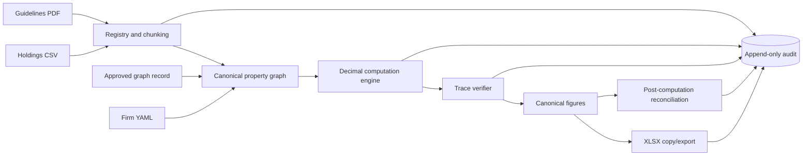
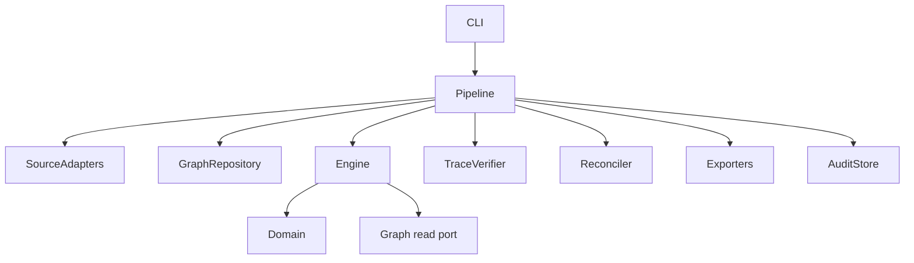
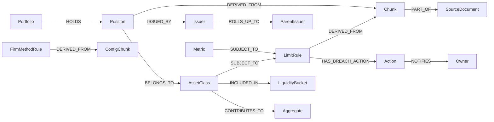
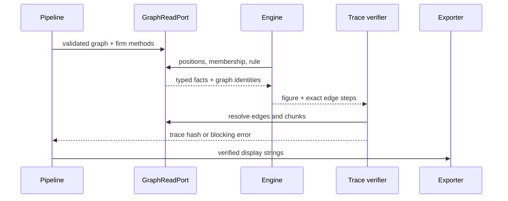

# Architecture

## Context and components

Dependency direction is `orchestration -> application modules -> domain`. The domain
uses the standard library plus model validation. Computation receives graph reads and a
validated generic strategy config only; it has no PDF, CSV, XLSX, answer-key, narrative,
or audit imports. I/O adapters render values but never recalculate them.

## Unified graph

Nodes and parallel directed edges have stable IDs and provenance. Canonical persistence
sorts both by ID and excludes observational timestamps. A recorded trace resolves exact
edge IDs rather than searching for a convenient path.

Docker runs one Python 3.12 CLI container. Source/approved fixtures are image inputs;
`output/` is mounted for reports and SQLite audit evidence.

